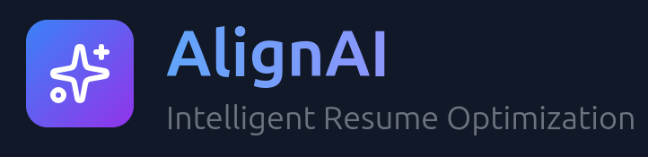
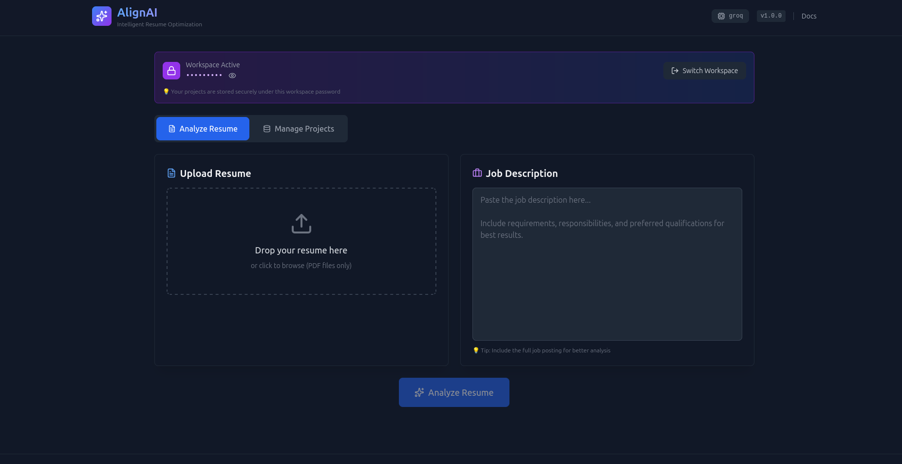

**AI-powered resume optimization that analyzes your application against job descriptions using LLaMA 3.**  
Intelligently ranks your projects using RAG, identifies missing keywords, and provides actionable feedback to boost your success rate.

## Usage

1. **Enter workspace password** - Create your isolated workspace
2. **Upload projects PDF** - Your projects are parsed and stored in vector database
3. **Upload resume & job description** - Get AI-powered analysis
4. **View results** - Compatibility score, missing keywords, and recommended projects

## How It Works

AlignAI uses Retrieval Augmented Generation (RAG) to match your resume with job requirements. When you upload your projects PDF, they're parsed and embedded into a vector database using Sentence Transformers. When analyzing a resume against a job description, the system semantically searches your project database to find the most relevant matches, ranks them by alignment, and uses LLaMA 3 to generate detailed feedback including missing keywords, ATS optimization tips, and an overall compatibility score. All data is isolated in password-protected workspaces using Pinecone namespaces.

---

**Tech Stack:** React, FastAPI, LLaMA 3 (Groq/Ollama), Pinecone, Sentence Transformers

**License:** MIT | **Author:** Darshan Rajopadhye

📚 [Setup Guide](./docs/SETUP.md)